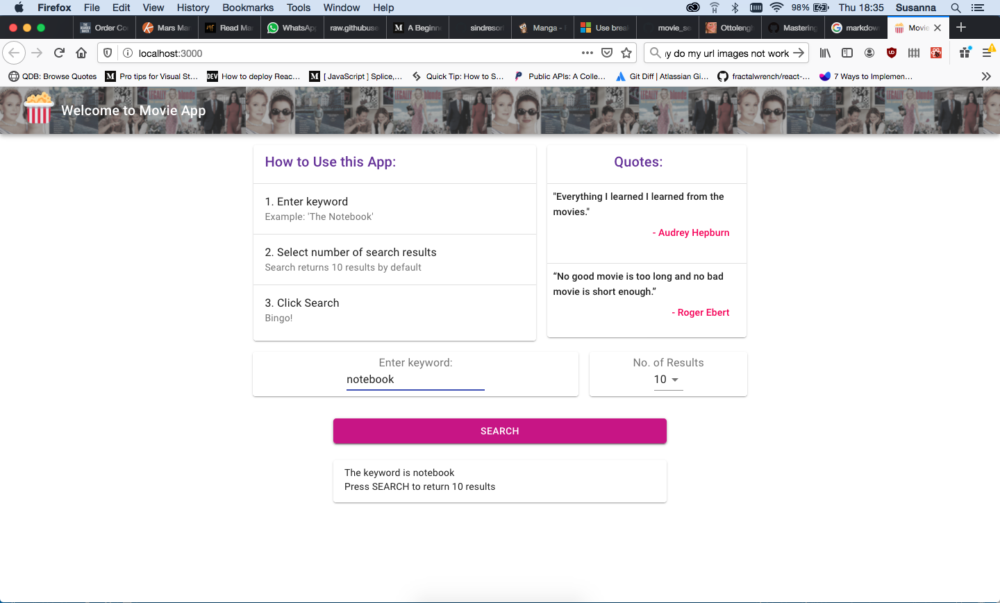
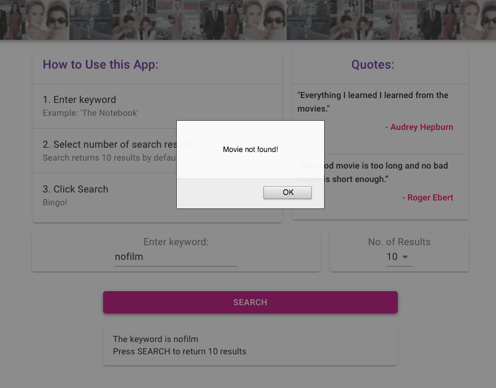
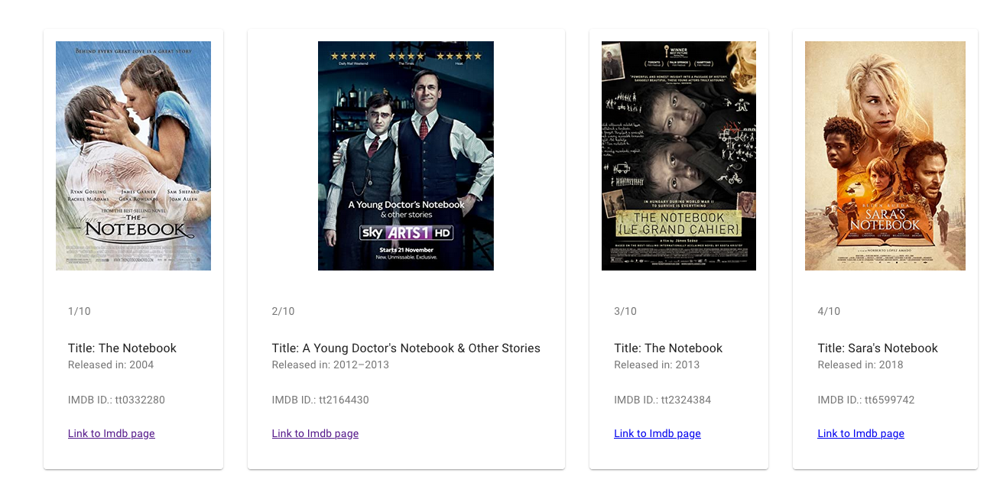
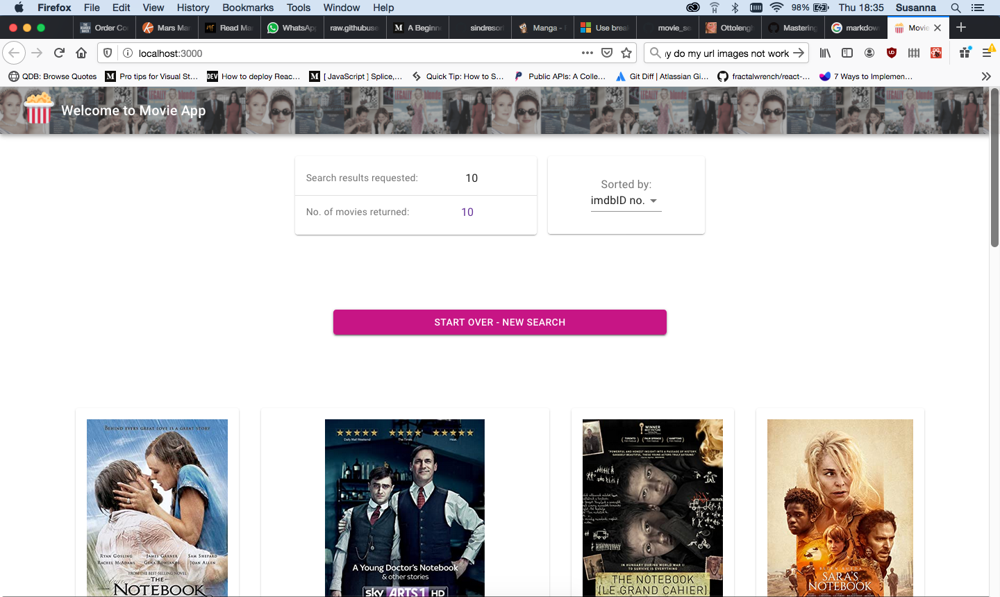
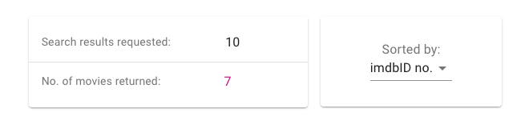
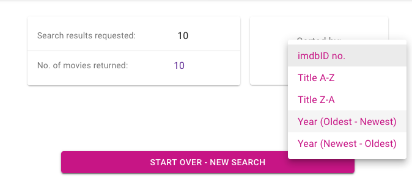

This project was bootstrapped with [Create React App](https://github.com/facebook/create-react-app).

# RB's Movie App #

## An App for Movie Searches

Search for movies stored on the ImDb database. 

Users can search via a keyword and select the number of search results they require. 

The app fetches data from an API and displays an image & key information about each movie. 
The search results can be sorted by title, release date or id.

Text on the page is updated to reflect the current selected no. of results and user input. The app alerts the user if no search results are found for user input. 

User Reviews:

> "The stuff of dreams" - RB herself

> "The OmDb database won't know what's hit it" - Anonymous


## Motivation

This is my first app I have created to put knowledge learnt of **Javascript** and **HTML** into practice. 

It allowed the opportunity to engage with **React**, using `<Components>` and **CSS** Styling to produce a user interface. 

It also involved establishing a **gitHub** workflow, using *pull requests*, *branches* and *documentation* to maintain a repository in collaboration with ~~my boyfriend~~ reviewers and contributors. 


## Code Style

This project follows standard JS codestyle and *contributions should be validated locally with ESLint*.

## Tech/Framework Used

Built with

    ReactJS
    Material UI
    Jest testing framework & React Testing Library

## Features

This project demonstrates ```rigour through testing``` and validation of input / output. Test written using React Testing Library verify Component behaviour and expected end-user experience. Components implement typechecking of passed props via propTypes. ESLint provides an additional syntax check. The user interface is designed to provide visible validation of user input in several instances, and highlights to a user when a request has not been met via alerts or styling. 

The project seeks to create a ```clear and simple layout``` for ease of navigation. Instructions are provided on the opening page as a prompt and assist. Search results are organised in a clear consistent layout for legibility. 


## Code Walkthrough

### Movie App ###
MovieApp is the Parent Component Class and renders Child Components. It manages state and passes props to its five children. It also executes a HTTP request to API.

```javascript
class MovieApp extends React.Component {

    constructor(props) {
        super(props);
        this.state = { 
            keyword: "", 
            movie: null,
            results: 10,
            isPerformingSearch: false,
            sort: null,  // or Object 
        }
```

### Input Field ###
`<InputField/>` renders static text and interactive elements: an input field and dropdown list of numbers. 

When a user types into the input field, this updates MovieApp.state.keyword via MovieApp's updateKeyword() function.

When a user selects a number from the dropdown, this updates MovieApp.state.results via MovieApp's updateNoOfResults() function. This determines the number of search results that the app returns. If none selected, 10 results are returned by default. 

If a search has been run, InputField will not render the above elements. 



### Search Button ###
`<SearchButton/>` initially renders a search button. 
If no keyword has been provided, the search button is inert. 

If a keyword is provided, clicking the search button fires a HTTP GET request to OmDb API via MovieApp's fetchMovieData() function. 

If no data is found, the app fires an alert message. 



The data returned is an array of nested objects containing information in key-value pairs. Each object represents one movie. The fetchMovieData() function stores this data by updating MovieApp.state.movie.

The fetchMovieData() function updates MovieApp.state.isPerformingSearch to 'true' to indicate a search has been run. 

```javascript
fetchMovieData() {
        if (this.state.keyword) { 
            const wordQuery = this.state.keyword;
            const apiKey = '9990ead4';
            const url = 'http://www.omdbapi.com/?';
            const queryParams = 's='; 
            const endpoint = url + 'apikey=' + apiKey + '&' +  queryParams + wordQuery;
             
            fetch(endpoint)
            .then(response => response.json())  
            .then(data => {
                if (data.Response === "False") { 
                    alert(data.Error);
                } else {
                    const movieData = data.Search;  
                    this.setState({movie: movieData});
                    this.setState({isPerformingSearch: true});
                };
            }) 
        };
    }
```


### Search Results ###
If a search has not been run, `<SearchResults/>` renders responsive text echoing the current value of the input field and number of results. 
If a search has been run, `<SearchResults/>` receives MovieApp.state.movie as props and renders as text and imagery.
The search results display image, title, release date (year) and ImDb ID no for each movie. A hyperlink links to that movie's ImDb page.



### Sort Criteria Dropdown ###
If a search has been run, `<SortCriteriaDropdown/>` renders static text and a dropdown list. Note that when only one search result is returned, the dropdown list is disabled. 



The static text allows the user to see if the number of results returned is as per their selection. 
If it is, the text is purple. If it is not, the text will be pink.



The dropdown list allows movie results to be sorted by several categories such as 'Title A-Z'. 



When a user selects an option, this updates MovieApp.state.sort with the relevant Object from SortCriteriaObjects.js.
 `<SearchResults/>` receives this Object as props, sorts the results accordingly and re-renders.

### Sort Criteria Objects.js ###
A Module containing enumerated Objects, imported and used by `<MovieApp/>` and `<SortCriteriaDropdown/>`
The Object holds information for each sort category, including a callback comparator function ready to be passed as an argument to array.sort() to sort search results. 

```javascript
function sortMovies (a, b, propertyName) {
    const movieA = a[propertyName]; 
    const movieB = b[propertyName];         
    let comparison = 0;

    if (movieA > movieB) {
        comparison = 1
    } else if (movieA < movieB) {
        comparison = -1
    };
    return comparison;
}

const sortCriteria= {

        IMBDID : {
            name: "IMBDID",
            userMessage: "imdbID no.", 
            category: "imdbID",
            comparator(a,b) {
                return sortMovies(a, b, "imdbID");
            }
        },
```


## Getting Started

Run npm start or npm test in Terminal 

## API Reference

Omdb API full reference docs here: http://www.omdbapi.com/

All data requests to be sent to:
http://www.omdbapi.com/?apikey=[yourkey]&

Search for multiple films by title using parameter 's'
Search results will return key information only: Title, ID no. , release Year and a Poster image. 

Search for a single film by ID or Title using parameters 'i' and 't' respectively
A successful search result will comprise of lots of additional information about the movie. 

## Tests

To run tests, run npm test in Terminal. 
Describe and show how to run the tests with code examples.

## How to use?

1.  Load page. 
2.  Enter a keyword into the input field. The text below will update to reflect and confirm your current input. 
3.  Select the number of search results you require. The text will update to reflect and confirm your choice. 
    If no number is selected, this will default to '10'.
4.  Click 'Search' to execute search. 
5.  The search results return sorted by ImDb ID. Select from the dropdown list to sort by a different category. 
6.  To begin a new search, click the Start Over - New Search button. 

## Contribute

Let people know how they can contribute into your project. A contributing guideline will be a big plus.

## Credits

Thanks to the following resources for debugging wisdom and programming guidance: 

[GitHub Markdown guide](https://guides.github.com/features/mastering-markdown/)

## License


## Available Scripts

In the project directory, you can run:

### `npm start`

Runs the app in the development mode.<br />
Open [http://localhost:3000](http://localhost:3000) to view it in the browser.

The page will reload if you make edits.<br />
You will also see any lint errors in the console.

### `npm test`

Launches the test runner in the interactive watch mode.<br />
See the section about [running tests](https://facebook.github.io/create-react-app/docs/running-tests) for more information.

### `npm run build`

Builds the app for production to the `build` folder.<br />
It correctly bundles React in production mode and optimizes the build for the best performance.

The build is minified and the filenames include the hashes.<br />
Your app is ready to be deployed!

See the section about [deployment](https://facebook.github.io/create-react-app/docs/deployment) for more information.

### `npm run eject`

**Note: this is a one-way operation. Once you `eject`, you can’t go back!**

If you aren’t satisfied with the build tool and configuration choices, you can `eject` at any time. This command will remove the single build dependency from your project.

Instead, it will copy all the configuration files and the transitive dependencies (webpack, Babel, ESLint, etc) right into your project so you have full control over them. All of the commands except `eject` will still work, but they will point to the copied scripts so you can tweak them. At this point you’re on your own.

You don’t have to ever use `eject`. The curated feature set is suitable for small and middle deployments, and you shouldn’t feel obligated to use this feature. However we understand that this tool wouldn’t be useful if you couldn’t customize it when you are ready for it.

## Learn More

You can learn more in the [Create React App documentation](https://facebook.github.io/create-react-app/docs/getting-started).

To learn React, check out the [React documentation](https://reactjs.org/).

### Code Splitting

This section has moved here: https://facebook.github.io/create-react-app/docs/code-splitting

### Analyzing the Bundle Size

This section has moved here: https://facebook.github.io/create-react-app/docs/analyzing-the-bundle-size

### Making a Progressive Web App

This section has moved here: https://facebook.github.io/create-react-app/docs/making-a-progressive-web-app

### Advanced Configuration

This section has moved here: https://facebook.github.io/create-react-app/docs/advanced-configuration

### Deployment

This section has moved here: https://facebook.github.io/create-react-app/docs/deployment

### `npm run build` fails to minify

This section has moved here: https://facebook.github.io/create-react-app/docs/troubleshooting#npm-run-build-fails-to-minify
